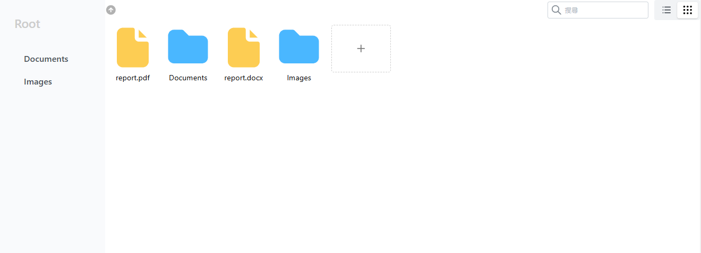
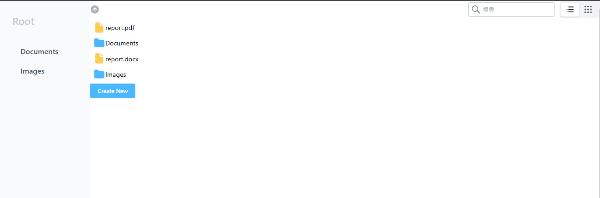

# 🗂️檔案管理

<!--  -->
<!--  -->
## ⭐️檔案管理以清單呈現

## ⭐️檔案管理以圖示呈現

## ⭐️建立新的資料夾/檔案

## ⭐️建立檔案選擇檔案類型


## 📖 資料結構

如果 isDir=false ,category 則為必填</br>
category: 'product' | 'sorting'

```js
const fs = [
  { id: "0", name: "/", path: "/", isDir: true },
  {
    id: "1",
    name: "123.製品",
    isDir: false,
    parentId: "0",
    lastModified: 1677021347,
    path: "/",
    category: "product",
  },
  {
    id: "2",
    name: "所有的排版專案",
    isDir: true,
    parentId: "0",
    path: "/所有的排版專案",
    lastModified: 1704720512,
  },
];
```

## ⚙️所有檔案管理功能

- 切換 亮暗色
- 檔案管理 顯示模式: 清單、Icon
- 按下返回上一層資料夾
- 詳細資訊 資料夾/檔案
- 新增 資料夾/檔案
- 重新命名 資料夾/檔案
- 刪除 資料夾/檔案
- 複製 資料夾/檔案
- 剪下 資料夾/檔案
- 貼上 資料夾/檔案
- 搜尋 資料夾/檔案
- 下載 資料夾/檔案
- 上傳 資料夾/檔案

---

## ✅目前Ok的功能

- 檔案管理 顯示模式: 清單、Icon
- 按下返回上一層資料夾
- 詳細資訊 資料夾/檔案
- 新增 資料夾/檔案
- 重新命名 資料夾/檔案
- 刪除 資料夾/檔案
- 複製 資料夾/檔案
- 剪下 資料夾/檔案
- 貼上 資料夾/檔案

---

## 🌀還沒做的功能

- 任一點一處按下右鍵開啟menu, 貼上
- 切換 亮暗色
- 搜尋 資料夾/檔案
- 下載 資料夾/檔案
- 上傳 資料夾/檔案
