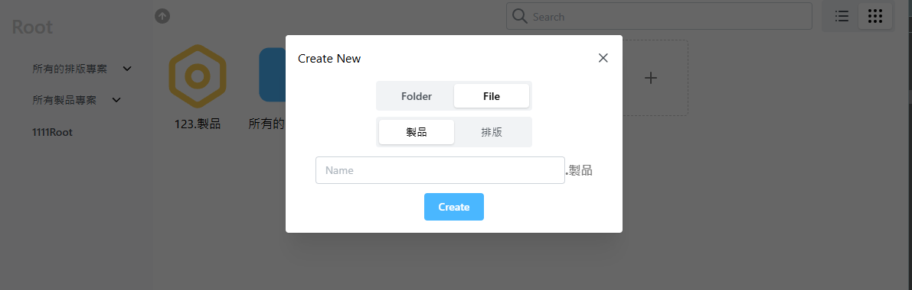
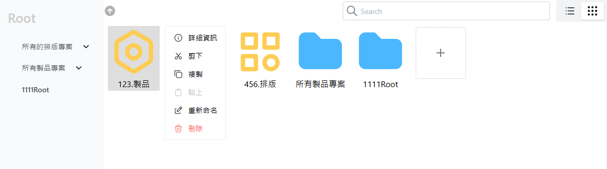
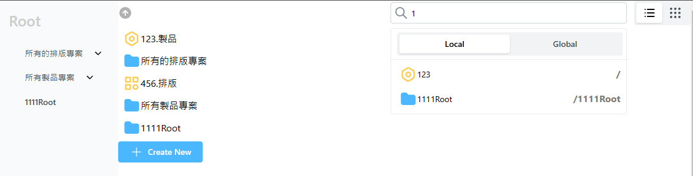

# 🗂️檔案管理

<!--  -->
<!--  -->


## ⭐️檔案管理系統的介紹影片
[](https://www.youtube.com/watch?v=影片ID)
https://youtu.be/qUI3NAs39mo

## ⭐️左側資料夾呈現方式
### 🌠以Tree的結構呈現


### 🌠點選資料夾會跳轉到該資料夾底下,並HightLight 該資料夾


## ⭐️檔案管理UI呈現

### 🌠以清單呈現


### 🌠以圖示呈現


## ⭐️建立新的資料夾/檔案


### 🌠資料夾


### 🌠檔案, 並選擇專案類型(製品、排版)



## ⭐️右鍵的功能選單



## ⭐️搜尋資料夾/檔案功能, 可選擇 Local、Global
### 🌠選擇 Local

### 🌠選擇 Global


## ⭐️點選 搜尋資料夾/檔案的下拉選單

### 🌠點選 資料夾, 則會跳轉到該資料夾底下


### 🌠點選 檔案, 該檔案會被HightLight


## 📖 資料結構

如果 isDir=false ,category 則為必填</br>
category: 'product' | 'sorting'

💡<b> 檔案名呈現: 123.製品 ( 所以 name 不用包含製品、排版的字樣 )</br>
💡<b> 資料夾名呈現: 所有的排版專案

```js
const fs = [
  { id: "0", name: "/", path: "/", isDir: true },
  {
    id: "1",
    name: "123",
    isDir: false,
    parentId: "0",
    lastModified: 1677021347,
    path: "/",
    category: "product",
  },
  {
    id: "2",
    name: "所有的排版專案",
    isDir: true,
    parentId: "0",
    path: "/所有的排版專案",
    lastModified: 1704720512,
  },
];
```


## 📖 Tree的資料結構
```js
const tree = [
  {
    value:"所有的排版專案",
    label:"所有的排版專案",
    id: "2",
    name: "所有的排版專案",
    isDir: true,
    parentId: "0",
    path: "/所有的排版專案",
    lastModified: 1704720512,
    children:[
      {
        value:"美而美專案",
        label:"美而美專案",
        id: "3",
        name: "美而美專案",
        isDir: true,
        parentId: "2",
        path: "/所有的排版專案/美而美專案",
        lastModified: 1686630289,
        children:[]
      },
      {
        value:"1111排版",
        label:"1111排版",
        id: "9",
        name: "1111排版",
        isDir: true,
        parentId: "2",
        path: "/所有的排版專案/1111排版",
        lastModified: 1679647141,
        children:[]
      },
    ]
  },
];
```

## ⚙️所有檔案管理功能

- 切換 亮暗色
- 檔案管理 顯示模式: 清單、Icon
- 按下返回上一層資料夾
- 詳細資訊 資料夾/檔案
- 新增 資料夾/檔案
- 重新命名 資料夾/檔案
- 刪除 資料夾/檔案
- 複製 資料夾/檔案
- 剪下 資料夾/檔案
- 貼上 資料夾/檔案
- 搜尋 資料夾/檔案
- 下載 資料夾/檔案
- 上傳 資料夾/檔案
- 點下任一處開啟menu(Create New、貼上)

---

## ✅目前Ok的功能

- 檔案管理 顯示模式: 清單、Icon
- 按下返回上一層資料夾
- 詳細資訊 資料夾/檔案
- 新增 資料夾/檔案
- 重新命名 資料夾/檔案
- 刪除 資料夾/檔案
- 複製 資料夾/檔案
- 剪下 資料夾/檔案
- 貼上 資料夾/檔案
- 點下任一處開啟menu(Create New、貼上)

---

## 🌀還沒做的功能
- 切換 亮暗色
- 搜尋 資料夾/檔案
- 下載 資料夾/檔案
- 上傳 資料夾/檔案
